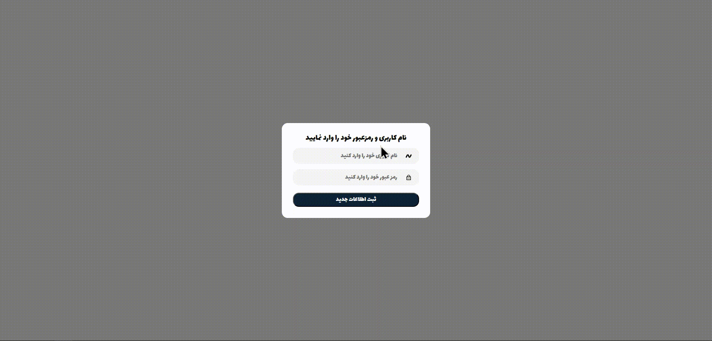

# <p align="center"> Hi there 👋 I'm Mohammad Hossein 👨‍💻 </p>
 <p align="center"> React Js expert and FrontEnd Developer from Iran.</p>

## Description Project
- A beautiful, full-responsive store CMS for all sizes on any device with 

- This CMS has various capabilities such as removal، add، update، taking information of various sections such as orders، users، discounts and remove or add administrator and ...

- This CMS is responsive from the width of the phone to the large screen, or even with the height of the screen is responsive

- Fully optimized and cleanly programmed and follows the `DRY` rule during the project

- On the main page of the CMS all the details of the website can be seen at a glance

- Website revenue is announced from the beginning of the month to the end of the same month.

- The latest registered users, non-existent products and the most buyers of the products of the website are reported on the home page

- One of the main advantages of this CMS is that it is completely dynamic and dynamic when something is updated does not refresh the page. 

>### Languages
>> 
>>
>> 
>> 
>> 
>> 
>> 

>### Packages
>> 
>> 
>> 
>> 
>> 
>> 
>> 

## View of the project
### Panel-Admin


### Show Responsive Page


### Login


## Getting Started


First of all, you need to have the wamp server and Node.Js installed on your system before you see these links. 

>[wamp server](https://www.wampserver.com/en/download-wampserver-64bits/)
>
>[node js](https://nodejs.org/en/download)

Before running the project, you need to have npm installed on your system, then you can set the following commands in the project path.

If you have node.js installed it will automatically install npm

`In addition, if you want to run the project faster, ignore the following commands and go to the Other > Videos > setting folder and proceed according to the videos`

After ensuring the installation of the mentioned items, enter the following commands in the direction of the project.

### `Step-1`

Run wamp server and then display the green icon of the software to `http://localhost/phpmyadmin/` address and enter the `root` word in the Username field and hit the login button to run the program

### `Step-2`

Then, after entering the mySql environment in the left panel, click on the New option and in the Create database, `sabzlearn_shop` the name of the database and in the front box, select this option `utf8mb3_persian_ci` considering that the cms is Persian, and click on create to create the database

### `Step-3`

Then click on import in the navigation menu above and in the File to import section select the files that were in the project SQL folder in order and click on the import button

### `Step-4`

Now it's time to select and import the project folder in the coding environment

### `Step-5`

Open a new terminal on the main path of the project and then enter this command

```
> cd backend
```

Then install the corresponding packages with the following command

```
> backend > npm i
```

After installing the packages, enter the following command to run the project backend

```
> backend > npm run start
```

### `Step-6` 

Open a new terminal on the main path of the project and then enter this command

```
> cd frontend
```

Then install the corresponding packages with the following command

```
> frontend > npm i
```

After installing the packages, enter the following command to run the project backend

```
> frontend > npm start
```

### `npm start`

Runs the app in the development mode.\
Open [http://localhost:3000](http://localhost:3000) to view it in your browser.

The page will reload when you make changes.\
You may also see any lint errors in the console.

___
>### Social Network
> [](https://github.com/khadem-mh)
> [](https://pinterest.com/khadem_mh)
> [](https://t.me/mhkhadem)
> [](https://wa.me/989031335939)
> [](https://wakatime.com/@khadem_mh)
